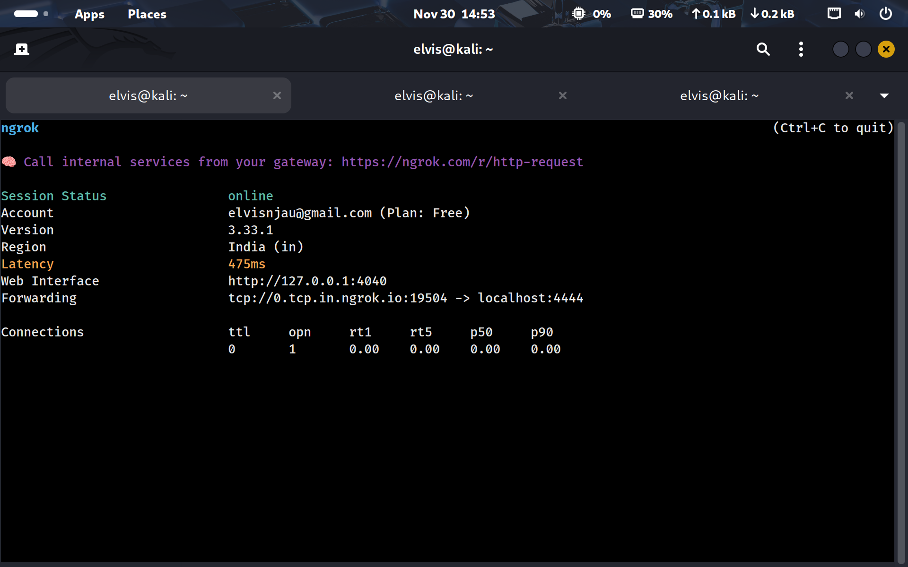
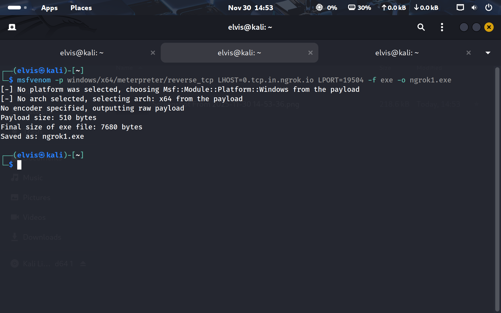
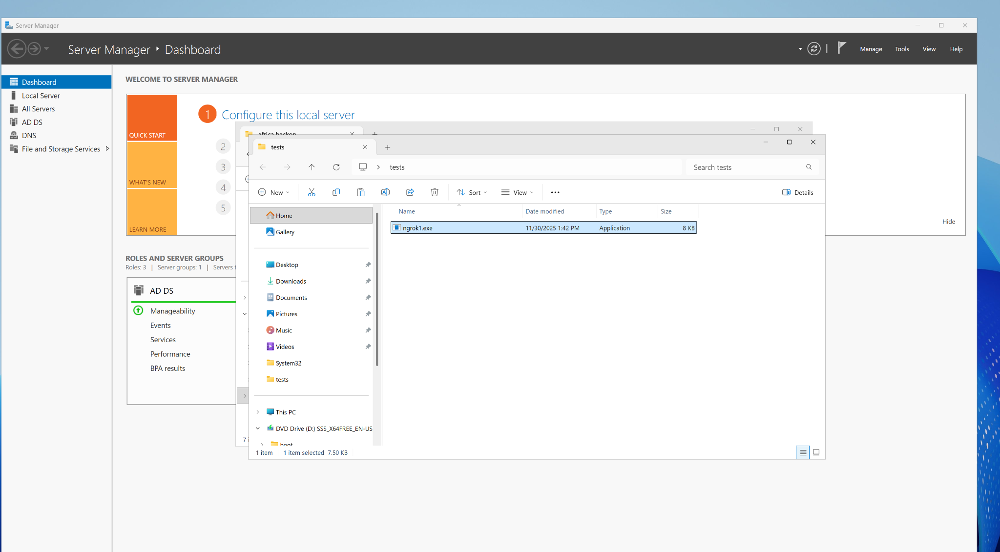
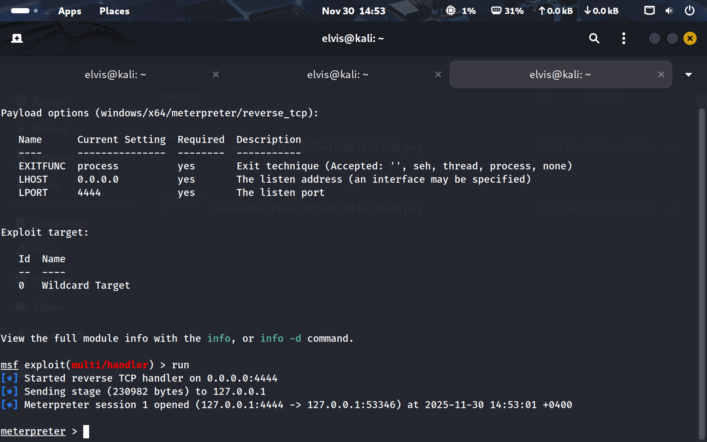
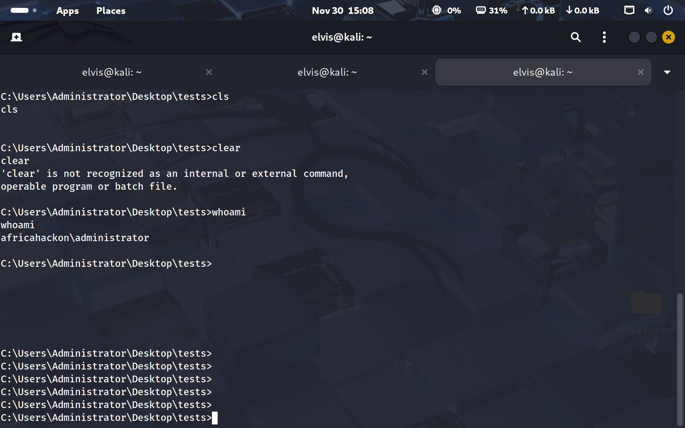

# Controlled Windows Exploitation and Reverse Shell Lab

## Objective
Completed a controlled four-stage Windows exploitation exercise using a tunnel, a generated reverse TCP payload, a Metasploit handler, and a verified remote shell.

### Skills Learned
- Exposed the local Metasploit listener through ngrok.
- Generated a Windows executable reverse TCP payload with the tunnel callback settings.
- Delivered and executed the payload on an authorized remote VM.
- Started multi/handler and confirmed a remote session.

### Tools Used
- Metasploit
- msfvenom
- Meterpreter
- multi/handler
- ngrok
- Windows VM

## Steps

*Ref 1: Ngrok setup and listening on port 4444*

*Ref 2: Meterpreter reverse tcp payload setup to direct traffic to ngrok on port 19504. Payload is exe format so that its executed on windows*

*Ref 3: Payload delivered on windows computer and executed*

*Ref 4: Metasploit handler listening on localhost port 4444*

*Ref 5: Shell attained on remote windows computer*

