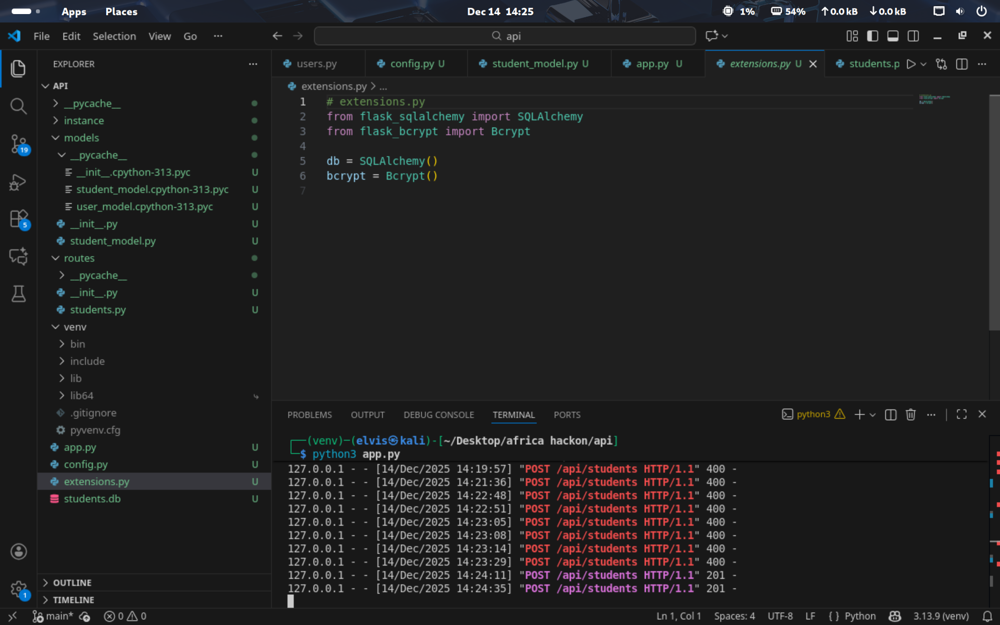
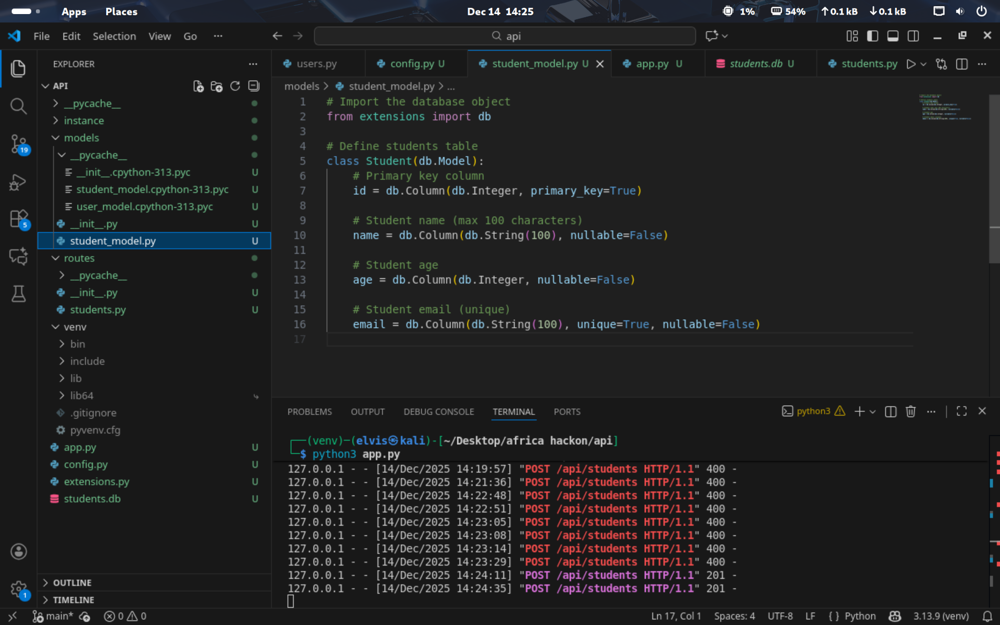
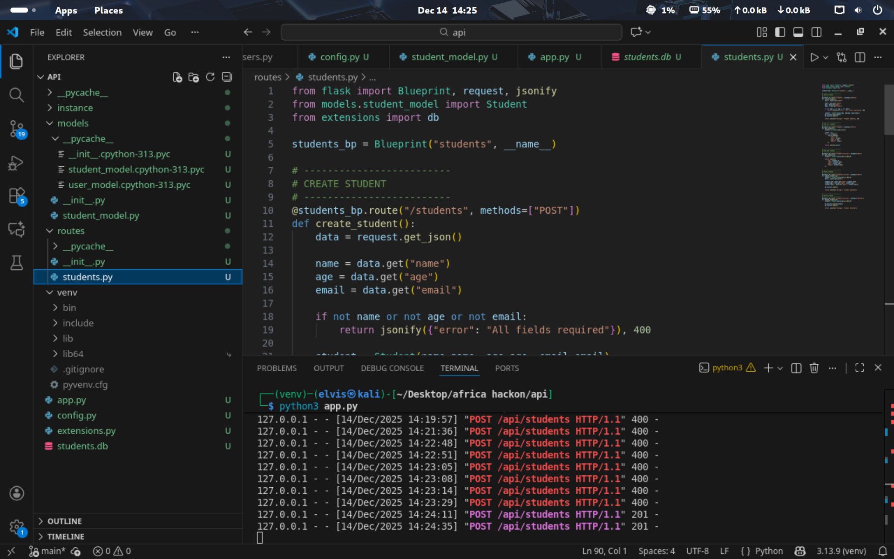
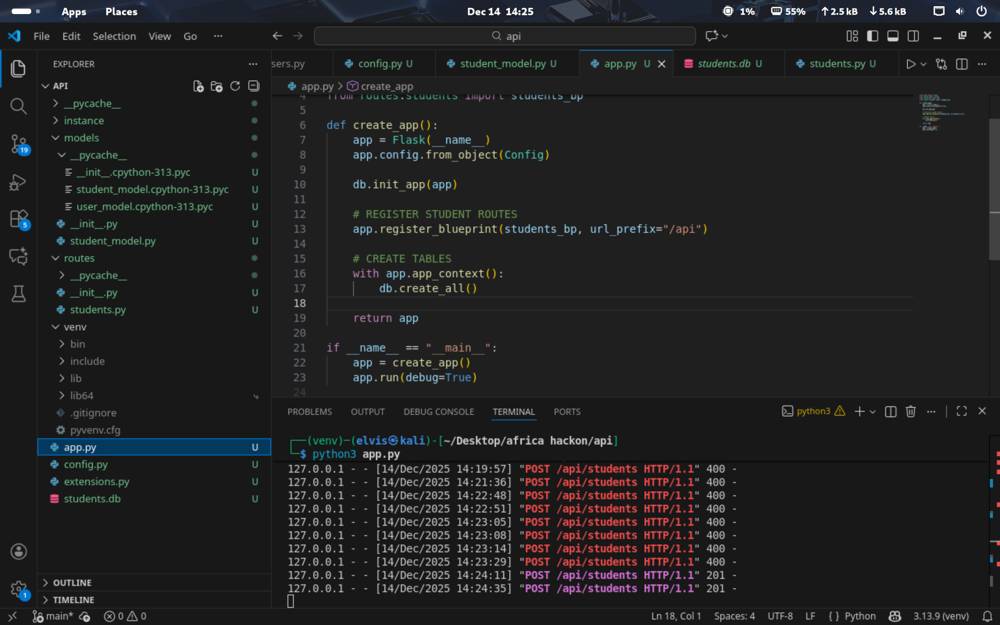
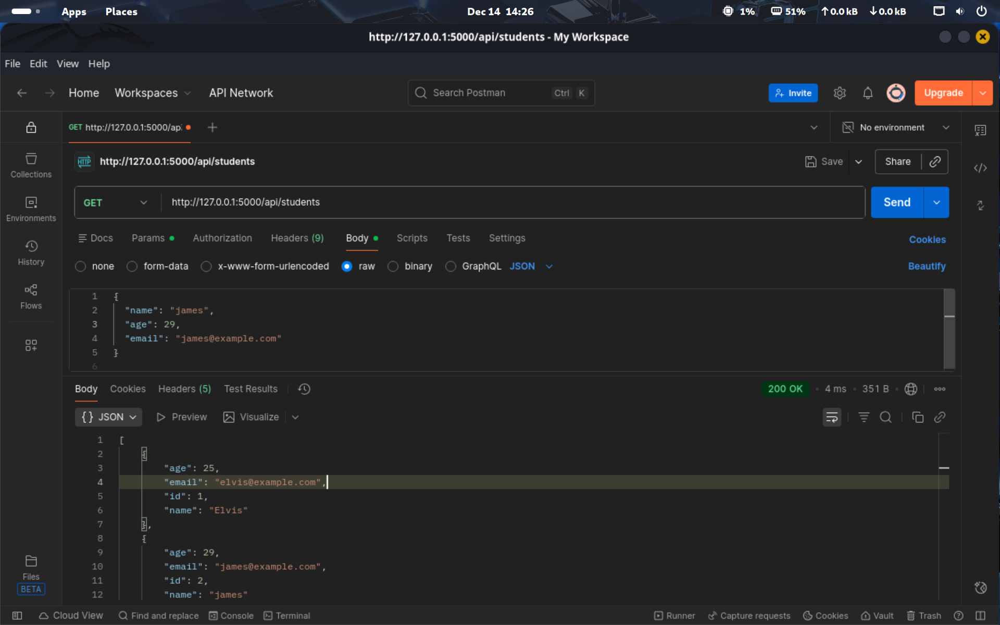
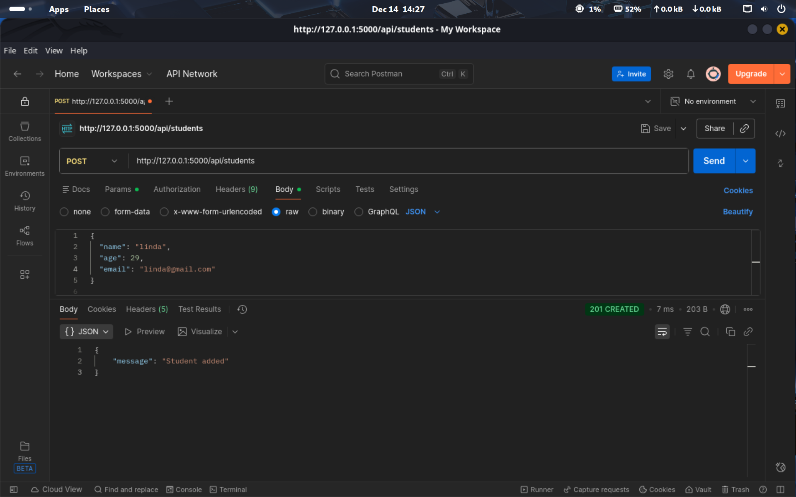
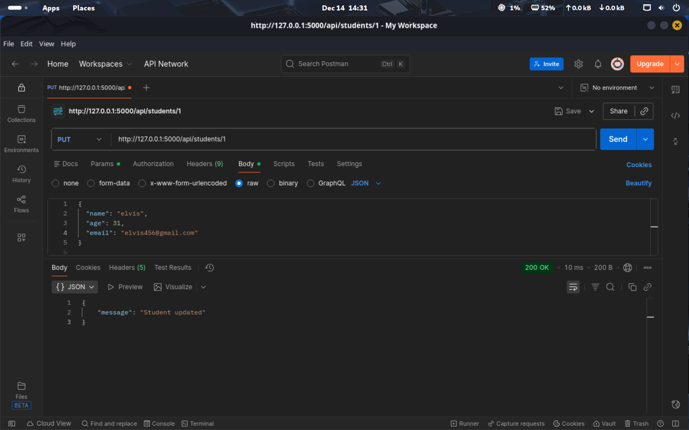
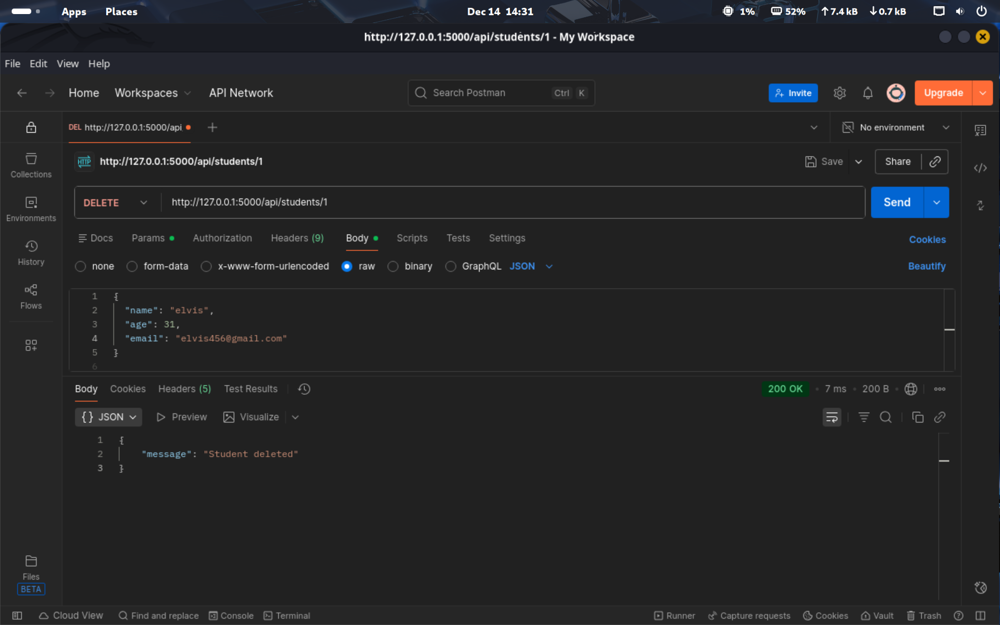

# Flask and MySQL Student Records API

## Objective
Implemented and tested a Flask API that connects to a MySQL student-records database and supports create, read, update, and delete operations.

### Skills Learned
- Created a normalized student table with an auto-incrementing primary key.
- Implemented routes for record creation, retrieval, email update, and deletion.
- Tested endpoint behavior and captured request/response evidence in Postman.
- Reviewed the data path from client input through application logic to MySQL.

### Tools Used
- Python
- Flask
- MySQL
- Postman
- REST APIs

## Steps

*Ref 1: Flask api that allows CRUD operations on a student database. Api end points have been tested with postman*

*Ref 2: Flask api that allows CRUD operations on a student database. Api end points have been tested with postman*

*Ref 3: Flask api that allows CRUD operations on a student database. Api end points have been tested with postman*

*Ref 4: Flask api that allows CRUD operations on a student database. Api end points have been tested with postman*

*Ref 5: Flask api that allows CRUD operations on a student database. Api end points have been tested with postman*

*Ref 6: Flask api that allows CRUD operations on a student database. Api end points have been tested with postman*

*Ref 7: Flask api that allows CRUD operations on a student database. Api end points have been tested with postman*

*Ref 8: Flask api that allows CRUD operations on a student database. Api end points have been tested with postman*

