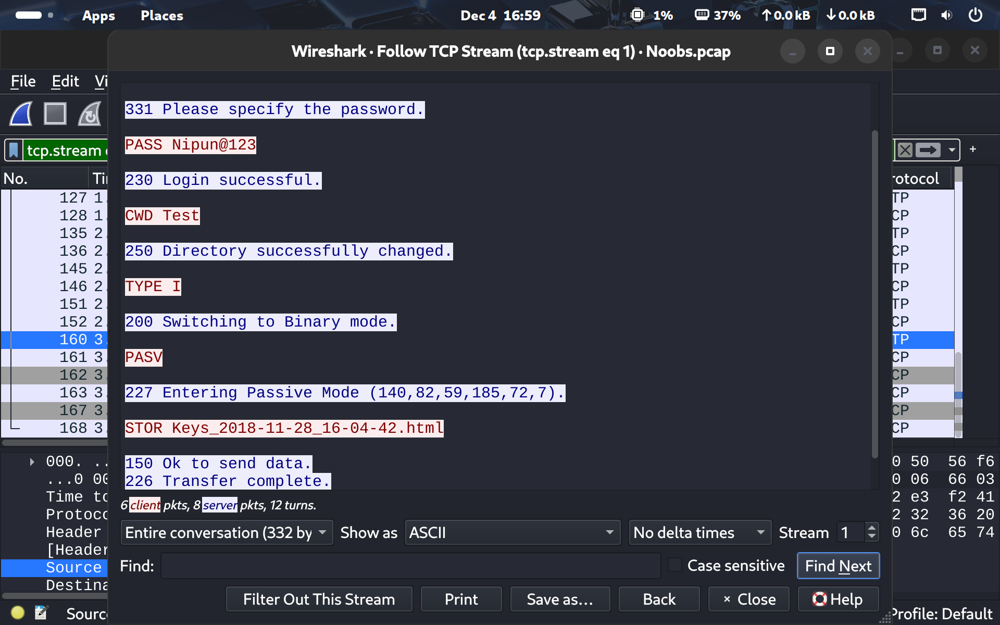
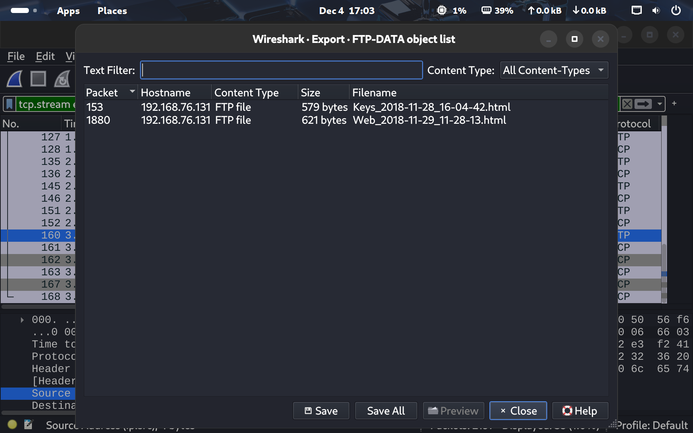
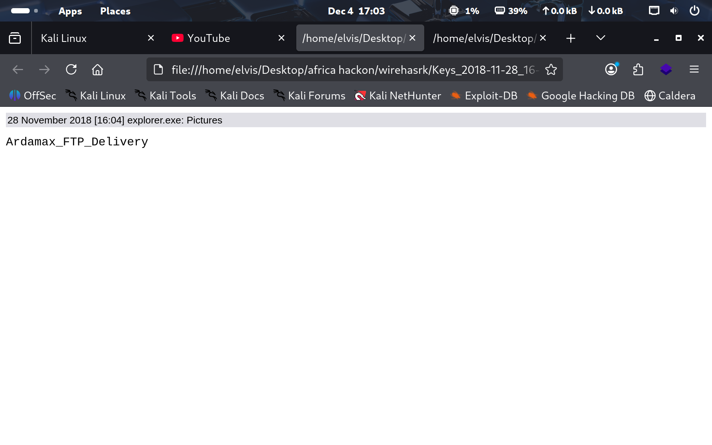
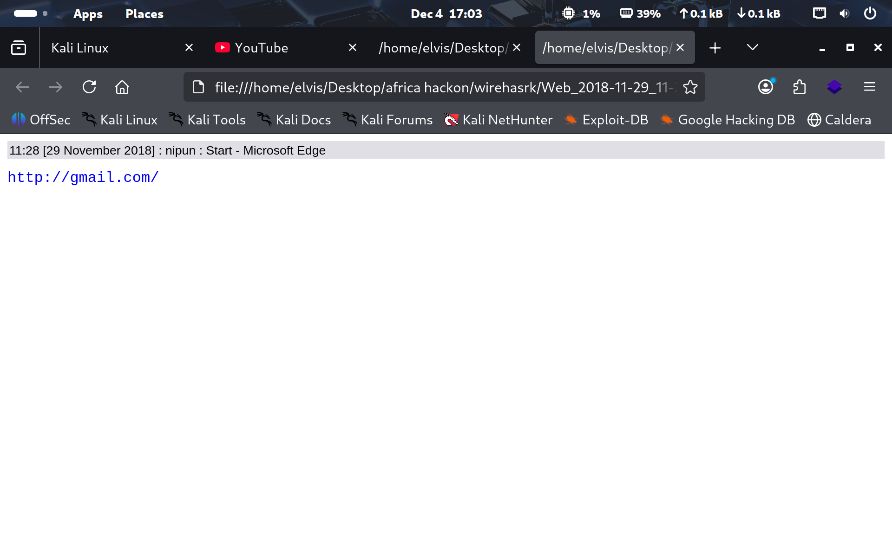
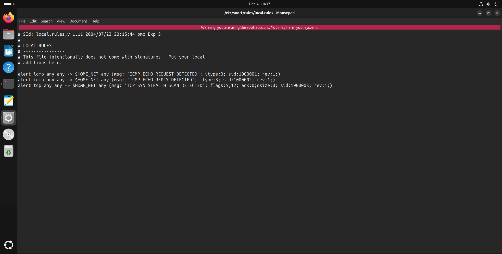
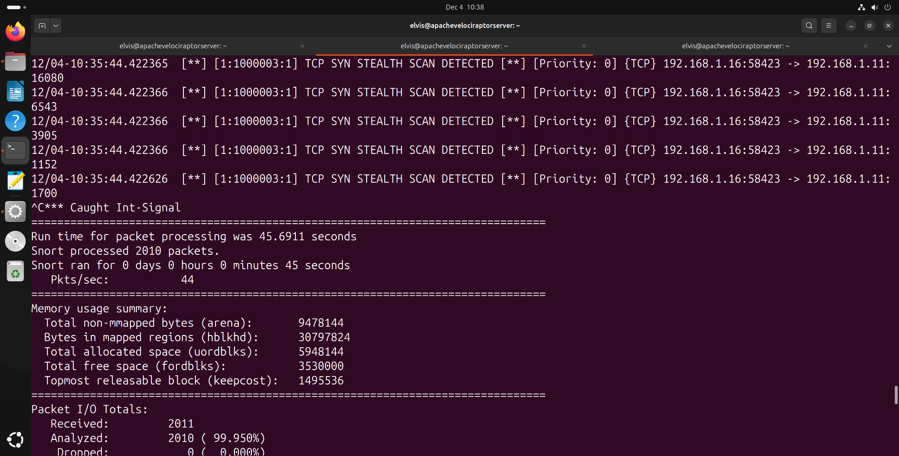
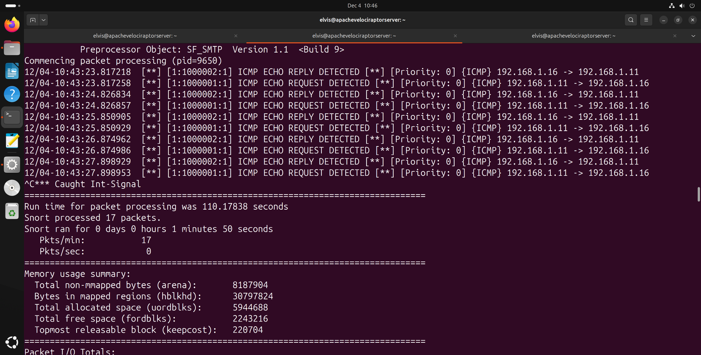
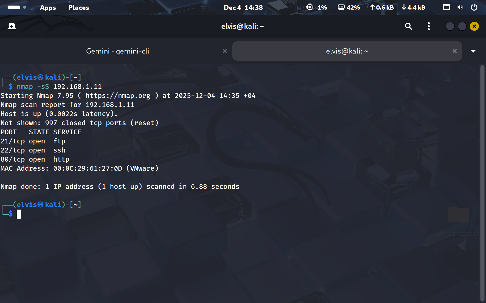
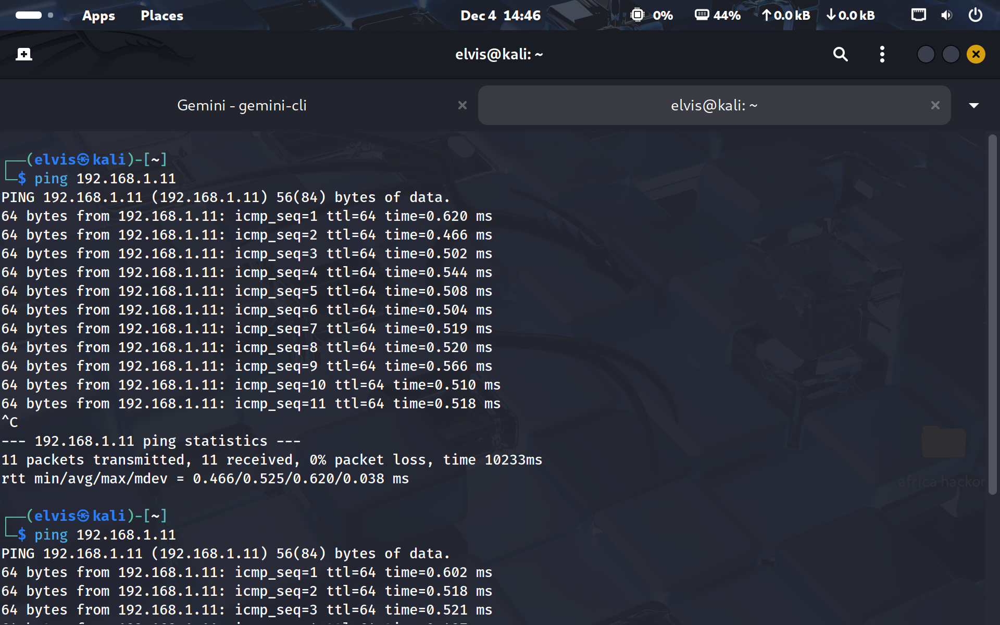

# Network Forensics and Snort Detection Engineering

## Objective
Investigated keylogger exfiltration in packet traffic and created Snort rules for ICMP and Nmap SYN-scan detection.

### Skills Learned
- Filtered traffic by protocol, host, port, flags, and credential-related strings.
- Traced keylogger exfiltration from the victim to attacker infrastructure.
- Recovered the username, password, URL, and two transferred HTML files.
- Created Snort rules for ICMP echo behavior and Nmap-style SYN packets with no payload.

### Tools Used
- Wireshark
- Snort
- PCAP analysis
- FTP/HTTP analysis
- Nmap traffic patterns

## Steps

*Ref 1: Assignment 2*

*Ref 2: Assignment 2*

*Ref 3: Assignment 2*

*Ref 4: Assignment 2*

*Ref 5: https://www.crowdstrike.com/en-us/cybersecurity-101/threat-intelligence/snort-rules/*

*Ref 6: https://www.crowdstrike.com/en-us/cybersecurity-101/threat-intelligence/snort-rules/*

*Ref 7: https://www.crowdstrike.com/en-us/cybersecurity-101/threat-intelligence/snort-rules/*

*Ref 8: https://www.crowdstrike.com/en-us/cybersecurity-101/threat-intelligence/snort-rules/*

*Ref 9: https://www.crowdstrike.com/en-us/cybersecurity-101/threat-intelligence/snort-rules/*

