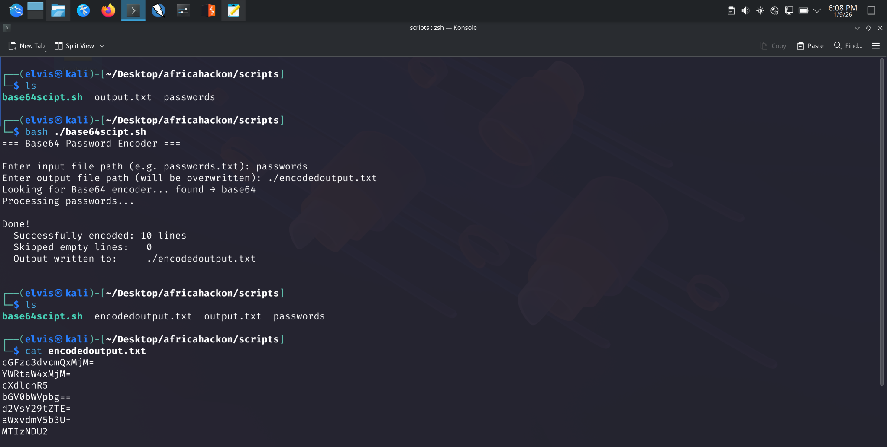
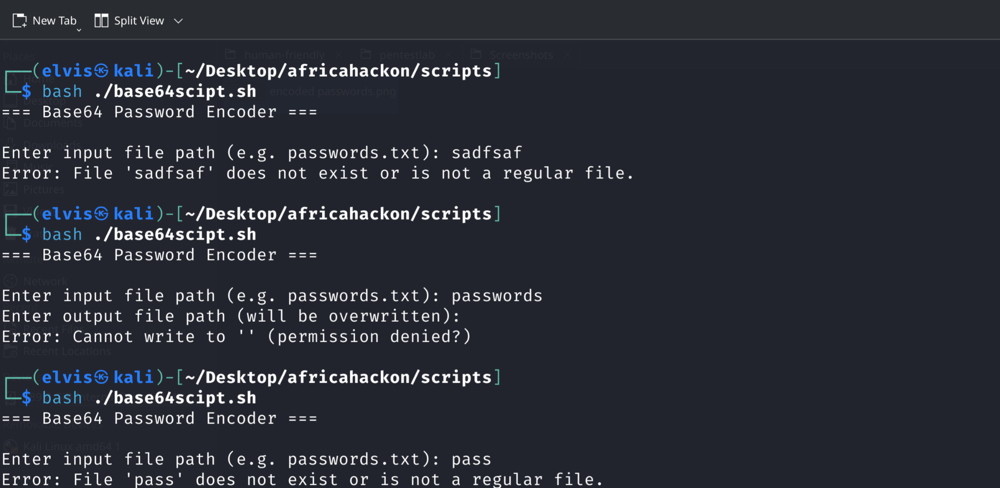

# Portable Bash Automation for Secure Data Transformation

## Objective
Built and tested a portable Bash workflow that reads password entries, skips blank lines, selects a working Base64 implementation, and writes ordered results with explicit failure handling.

### Skills Learned
- Validated that the input exists and is readable before processing.
- Probed available encoders and verified each candidate against a known value.
- Trimmed whitespace, skipped empty records, and preserved source order.
- Used non-zero exit codes and actionable messages for missing files, permissions, and unavailable tooling.

### Tools Used
- Bash
- base64
- OpenSSL
- Python 3 fallback
- POSIX file controls

## Steps

*Ref 1: A bashscript named base64script.sh that takes input from afile named passwords and outputs base 64 encoded passwords stored to file named encodedoutput.txt*

*Ref 2: Error handling: when non existent input file sadfsaf is used as input the error message “file does not exist” is displayed and script terminates.*

