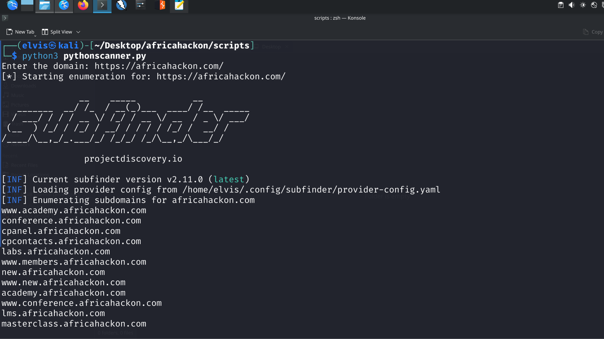
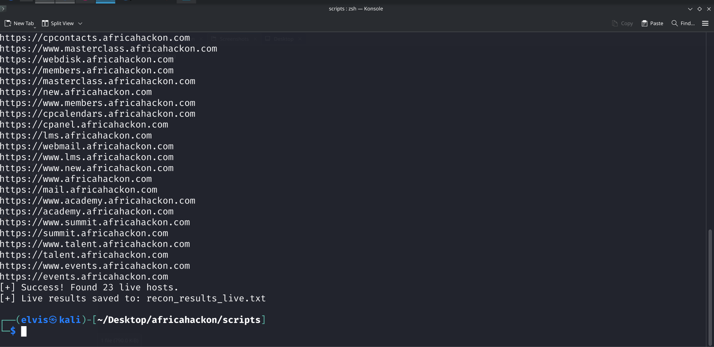
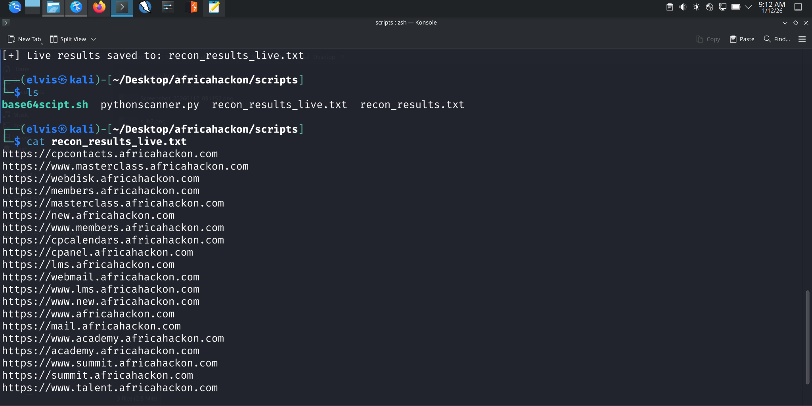

# Python Reconnaissance Automation

## Objective
Automated subdomain discovery and live-host probing by orchestrating Subfinder and httpx from a reusable Python command-line workflow.

### Skills Learned
- Accepted domain and output settings through CLI arguments or an interactive fallback.
- Executed Subfinder and verified that its result file existed and contained data.
- Passed discovered assets into httpx and counted responsive hosts.
- Handled missing binaries, failed subprocesses, empty results, and invalid input.

### Tools Used
- Python
- Subfinder
- httpx
- argparse
- pathlib
- subprocess

## Steps

*Ref 1: The script named pythonscanner.py prompts user to input domain then scans the domain for subdomain using subfinder tool.*

*Ref 2: The subdomains are then passed to httpx tool which checks if the subdomains are live and saves the results to file named recon_results_live.txt*

*Ref 3: Results of the live subdomains are displayed on the screenshot above*

