# SOC Automation and Detection Engineering Homelab

## Objective
Built and validated an end-to-end SOC homelab that inspects outbound traffic, centralizes network and endpoint telemetry in Splunk, and automates enrichment, case management, forensic collection, and host isolation through n8n, DFIR-IRIS, Velociraptor, and Wazuh.

### Skills Learned
- Engineered segmented traffic inspection with `pfSense`, `Squid Proxy`, and `Suricata`.
- Forwarded endpoint and network telemetry into `Splunk` for centralized correlation.
- Automated IOC enrichment, AI triage, ticketing, and response decisions with `n8n`.
- Triggered forensic collection with `Velociraptor` and host isolation with `Wazuh Active Response`.
- Validated both high-risk and low-risk alert paths with controlled synthetic events.

### Tools Used
- pfSense
- Squid Proxy
- Suricata
- Splunk
- Sysmon
- Wazuh
- n8n
- DFIR-IRIS
- Velociraptor
- VirusTotal
- LM Studio or Ollama

## Steps

*Ref 1: Inter-VLAN telemetry flow and SOAR remediation pipeline control vectors.*

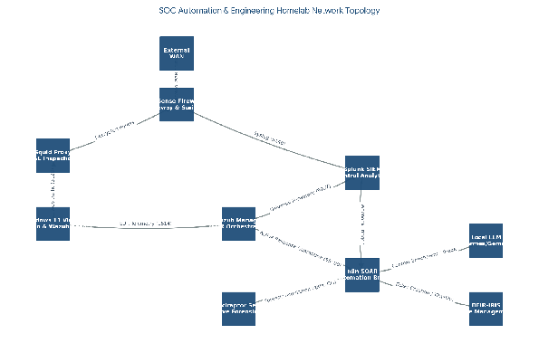

*Ref 2: Consolidated homelab architecture connecting perimeter inspection, telemetry, SIEM, and response services.*

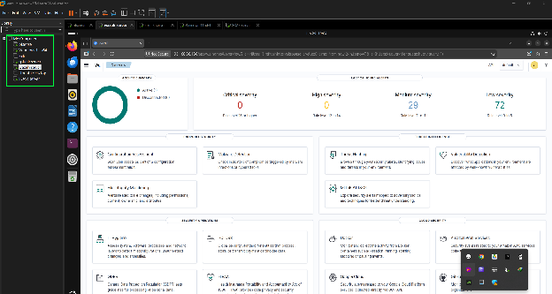

*Ref 3: `pfSense` perimeter configuration supporting LAN control, proxy routing, and inspection.*

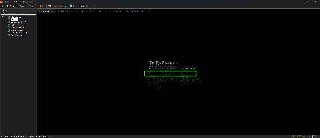

*Ref 4: Windows 11 endpoint prepared with `Sysmon`, `Splunk Universal Forwarder`, and `Wazuh Agent`.*

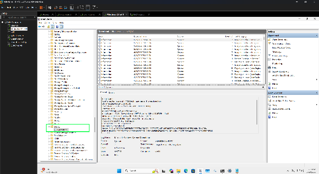

*Ref 5: Additional endpoint evidence showing the installed monitoring stack used during workflow validation.*

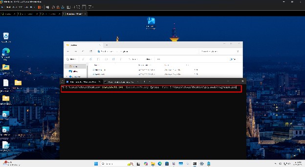

*Ref 6: Splunk evidence view used to validate the alerting and correlation stage before handing off to SOAR.*

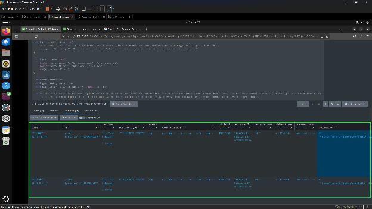

*Ref 7: Wazuh alert forwarding into the centralized workflow.*

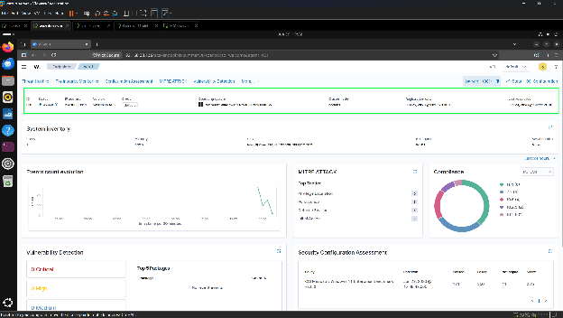

*Ref 8: Wazuh active response enforcing host isolation through a firewall rule.*

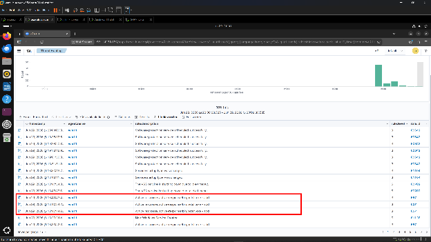

*Ref 9: `n8n` workflow receiving Splunk alerts and orchestrating the response chain.*

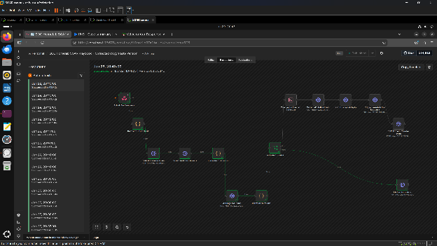

*Ref 10: `n8n` branching logic for enrichment, triage, case updates, and automated follow-on actions.*

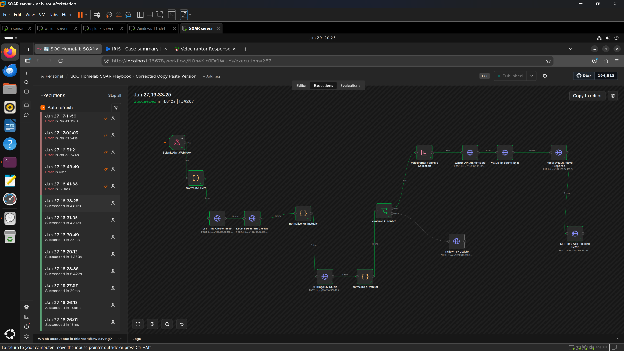

*Ref 11: `DFIR-IRIS` investigation case created and updated for each alert.*

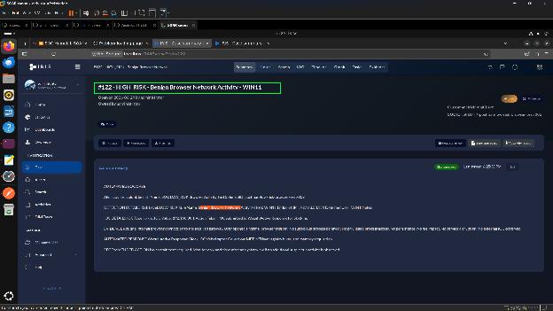

*Ref 12: `Velociraptor` forensic collection execution for the affected host.*

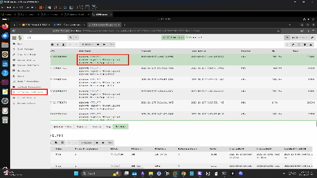

*Ref 13: Master File Table artifact collection captured during the response workflow.*

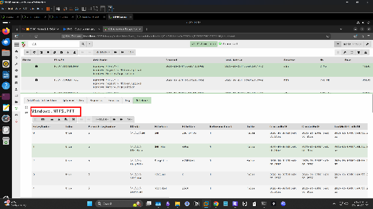

*Ref 14: Windows Registry artifact collection preserved as part of automated triage.*

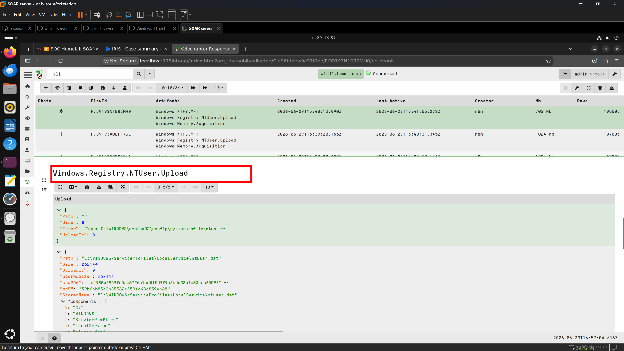
